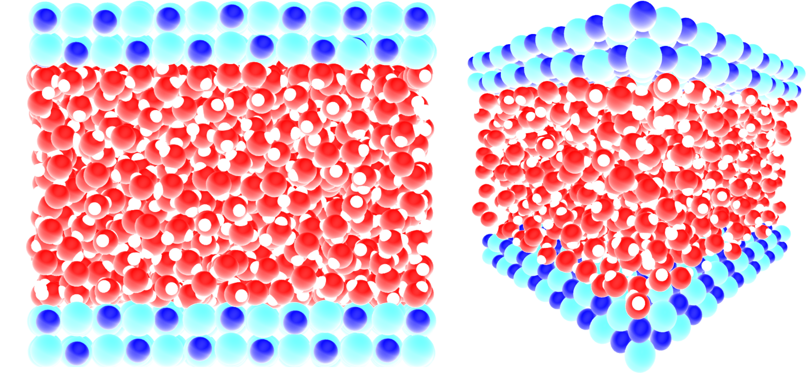
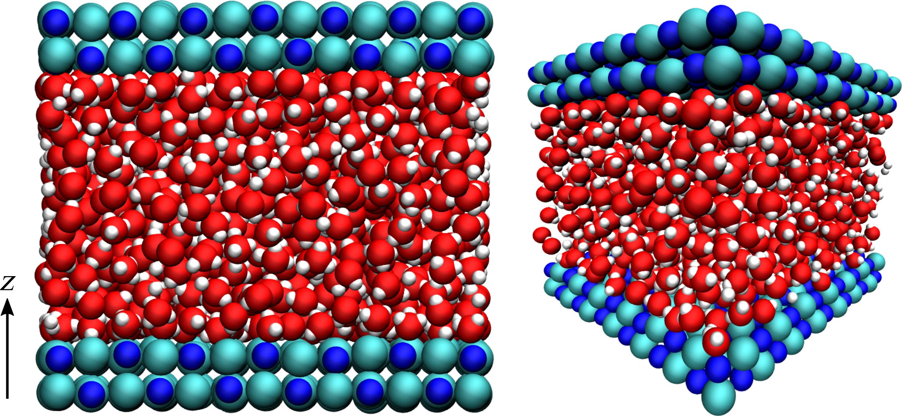

.. _userdoc-basic-usage:

Basic usage
===========

.. note::

  To follow this tutorial, it is assumed that MAICoS has been :ref:`installed
  <label_installation>` on your computer.

In this tutorial we will use the :class:`maicos.DensityPlanar` to extract the density profile
of water molecules confined in a 2D slit pore from a molecular dynamics simulation.
In general, all modules follow the same structure:

1. load your simulation trajectory and define atom selections
2. define analysis parameters like bin width or the direction of the analysis
3. after the analysis was succesful, access all results in a
   :class:`MDAnalysis.analysis.base.Results` of the analysis object.

.. important::

  Some of the calculations may contain pitfalls, such as dielectric profiles
  calculation. Potential pitfalls and best practices are listed in the
  :ref:`userdoc-how-to` section.

MAICoS can be used **equally** from the **Python interpreter** or the **CLI**. The
Python interpreter allows usually more versatile analysis scrcipts. But, using CLI
instead of the Python interpreter can sometimes be more comfortable, particularly for
lengthy standard analysis.

The documentation, almost exclusively describes the use of MAICoS from the Python
interpreter, but all operations can be equivalently performed from the CLI.

Loading library
---------------

.. tabs::

  .. group-tab:: Python

    .. include:: generated_tabs/usage-python.rst
      :start-after: .. import
      :end-before: .. loading

  .. group-tab:: Bash

    .. include:: generated_tabs/usage-bash.rst
      :start-after: .. import
      :end-before: .. loading

Opening trajectory
------------------

For this tutorial we use a system consisting of a 2D slab with 1176 water molecules
confined in a 2D slit made of NaCl atoms, where the two water/solid interfaces are
normal to the axis :math:`z` as shown in the snapshot below:

An acceleration :math:`a = 0.05\,\text{nm}\,\text{ps}^{-2}` was applied to the water
molecules in the :math:`\boldsymbol{e}_x` direction parallel to the NaCl wall, and the
atoms of the wall were maintained frozen along :math:`\boldsymbol{e}_x`.

You can download the required :download:`topology
<../../../examples/basics/slit_flow.tpr>` and the :download:`trajectory
<../../../examples/basics/slit_flow.trr>` from our website.

.. tabs::

  .. group-tab:: Python

    .. include:: generated_tabs/usage-python.rst
      :start-after: .. loading
      :end-before: .. selection

  .. group-tab:: Bash

    .. include:: generated_tabs/usage-bash.rst
      :start-after: .. loading
      :end-before: .. selection

Selecting Subsets of Atoms
--------------------------

Now, we define an atom group containing the oxygen and the hydrogen atoms (of the water
molecules).

.. tabs::

  .. group-tab:: Python

    .. include:: generated_tabs/usage-python.rst
      :start-after: .. selection
      :end-before: .. analysis

  .. group-tab:: Bash

    .. include:: generated_tabs/usage-bash.rst
      :start-after: .. selection
      :end-before: .. analysis

Running an Analysis
-------------------

Let us use now finally use the :class:`maicos.DensityPlanar` class to extract the
density profile along the (default) :math:`z` axis by running the analysis.

.. tabs::

  .. group-tab:: Python

    .. include:: generated_tabs/usage-python.rst
      :start-after: .. analysis
      :end-before: .. plot

  .. group-tab:: Bash

    .. include:: generated_tabs/usage-bash.rst
      :start-after: .. analysis
      :end-before: .. plot

Visualizing Results
-------------------

We can now plot the density profile.

.. tabs::

  .. group-tab:: Python

    .. include:: generated_tabs/usage-python.rst
      :start-after: .. plot
      :end-before: .. help

  .. group-tab:: Bash

    .. include:: generated_tabs/usage-bash.rst
      :start-after: .. plot
      :end-before: .. help

    .. image:: ../../static/density_gnuplot.png
      :alt: Density from gnuplot
      :align: center

For this example we scales the error by 5 to be visible in the plot. More details on the
uncertainty estimation can be found in
:ref:`sphx_glr_generated_examples_basics_advanced-usage.py`.

Getting Help
------------

MAICoS provides help both for the main program and for each analysis module.

.. tabs::

  .. group-tab:: Python

    .. include:: generated_tabs/usage-python.rst
      :start-after: .. help
      :end-before: .. end

  .. group-tab:: Bash

    .. include:: generated_tabs/usage-bash.rst
      :start-after: .. help
      :end-before: .. end
